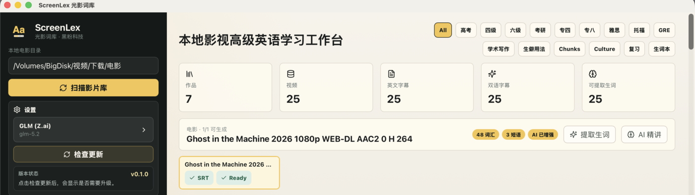
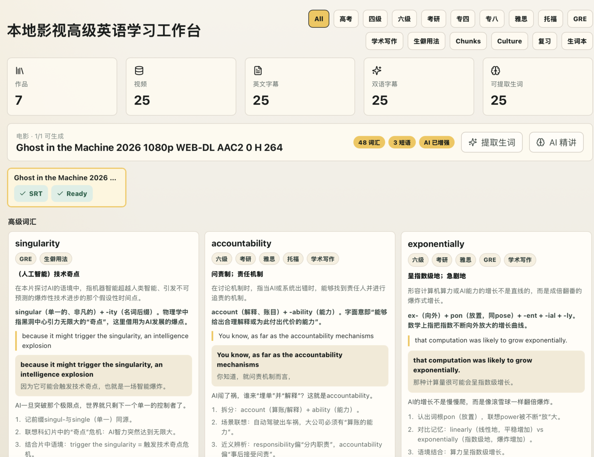
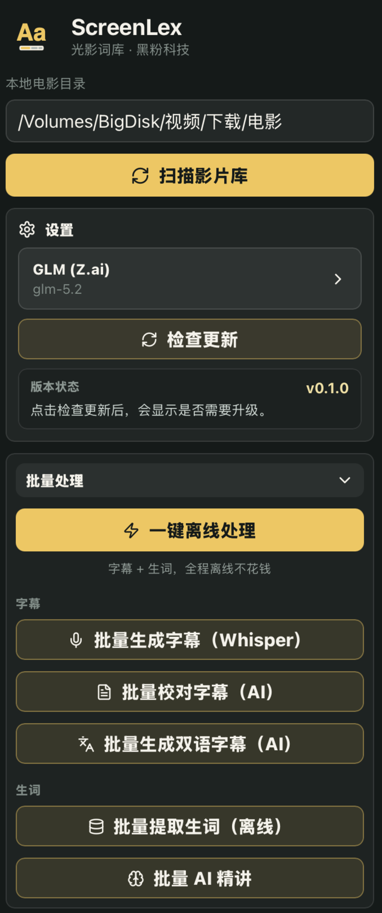

# ScreenLex 光影词库

ScreenLex 是黑粉科技 HyphenTech 出品的本地影视英语学习工具：把你本机已有的电影 / 剧集字幕，离线整理成按考试分级的高级英语词库，并配套逐句学习播放器与主动回忆复习。**支持 macOS（Apple Silicon）与 Windows（x64 arm）。**

> 它不提供电影、不分发字幕资源；内置播放器只服务逐句学习，不替代完整观影体验。纯本地运行，不上传任何片源或字幕。

## 下载

前往 **[Releases](https://github.com/HackerChi-Hub/screenlex-download/releases/latest)** 下载对应系统的安装包：

| 系统 | 安装包 | 说明 |
|------|--------|------|
| **macOS**（Apple Silicon） | `ScreenLex_x.y.z_aarch64.dmg` | 打开后将 ScreenLex 拖入「应用程序」 |
| **Windows**（10 / 11，x64 arm） | `ScreenLex_x.y.z_x64-setup.exe` | 双击安装，自动创建桌面与开始菜单快捷方式 |

软件内「检查更新」会自动获取并安装新版本（macOS 与 Windows 各自更新到同一版本号）。

## 主要功能（macOS / Windows 一致）

- 扫描本地电影 / 剧集，识别英文 SRT 与双语 ASS 字幕；
- 离线提取高级词汇、短语与中文释义，按高考 / 四六级 / 考研 / 雅思 / 托福 / GRE 分级；
- 可选 AI 精讲：例句、词源、记忆法、易混辨析、文化背景；
- 主动回忆复习 + 自适应间隔；朗读、跟读、听写；
- 逐句学习播放器：双语字幕、单句 / A-B 循环、倍速、时间点跳转；
- 本地 Whisper 补字幕、AI 校对、生成双语字幕、字幕体检；
- 首次使用「一键配置」自动下载并安装所需运行组件（FFmpeg、本地语音识别引擎、字幕模型），全部存放在程序目录内，可在向导中「全面清除」一键重置。

### 平台差异（仅系统兼容部分不同）

| 能力 | macOS | Windows |
|------|-------|---------|
| 本地语音识别引擎 | MLX Whisper（Apple Silicon 加速） | whisper.cpp（**自动检测硬件：NVIDIA 显卡走 GPU/cuBLAS 加速，其余用 CPU**；A 卡 / 核显 / 无卡均可用） |
| 「原片直放」全片播放（mpv） | ✅ 支持 | 暂不支持（使用内置 FFmpeg 学习片段播放器） |
| 其余全部功能 | ✅ | ✅ 一致 |

## 截图

## 安装提示

当前版本尚未进行代码签名与公证。

- **macOS**：若提示「无法验证开发者」，右键点 `ScreenLex.app` →「打开」，或在「系统设置 → 隐私与安全性」中允许打开。
- **Windows**：若 SmartScreen 提示「Windows 已保护你的电脑」，点「更多信息」→「仍要运行」。

## 法律

- [用户协议](./USER_AGREEMENT.md)
- [免责声明](./DISCLAIMER.md)

## 说明

ScreenLex 为闭源发布软件。本公开仓库仅用于发布安装包与说明，不包含源代码。
