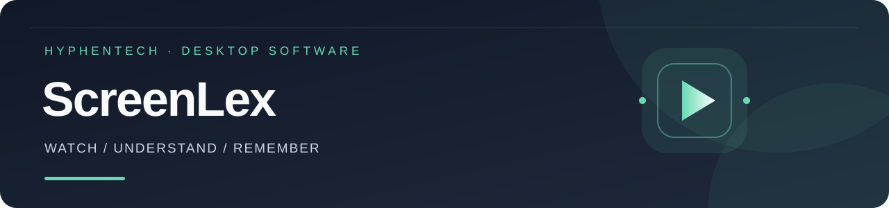
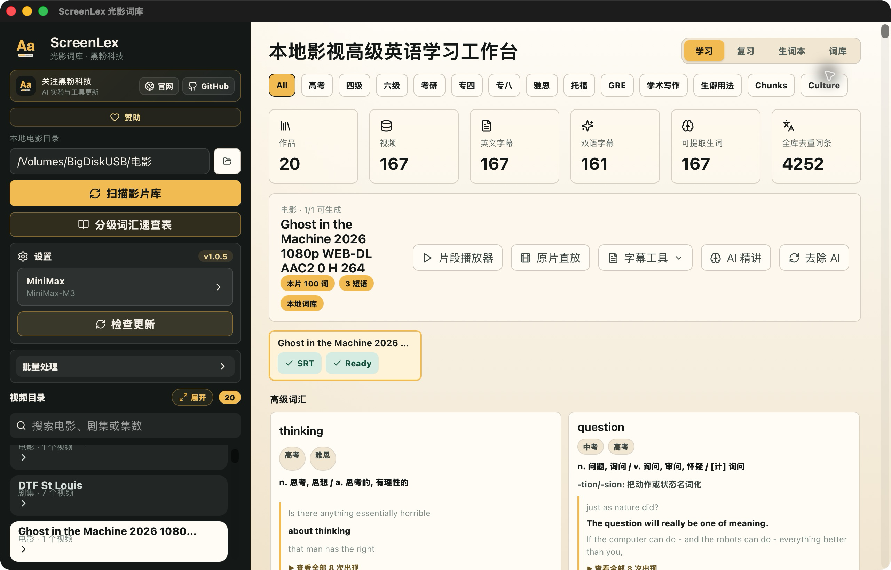
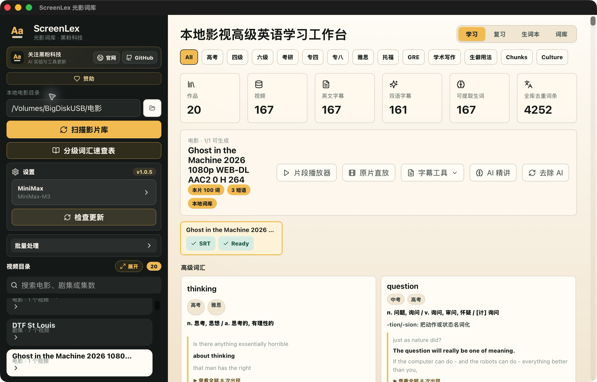
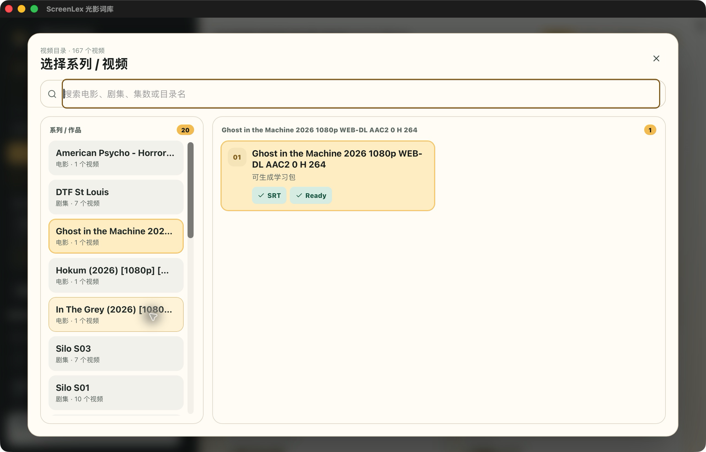

<!-- evergreen:intro:start -->


# 光影詞庫 ScreenLex · 看電影學英語、本地字幕查詞與間隔複習

**把本機電影、劇集和字幕，變成能播放原句、檢索詞彙、安排複習的英語學習系統。**

光影詞庫是黑粉科技開發的本地影視英語學習工具，面向美劇英語、電影英語和考試詞彙學習。掃描自己的影視目錄，識別英文或雙語字幕，離線提取單詞、短語和真實語境；用逐句播放、單句迴圈、主動回憶與間隔複習，把看過的表達留下來。支援 macOS、Windows 與 Linux，安裝包以下載表為準。


<p align="center"><a href="README.md">简体中文</a> | <a href="README.zh-TW.md">繁體中文</a> | <a href="README.en.md">English</a></p>

<p align="center"><a href="https://github.com/HackerChi-Hub/screenlex-download/releases/latest"></a> <a href="https://hyphentech.top"></a></p>
<!-- evergreen:intro:end -->

<!-- recent-features:start -->
## 近期新增與改進（最近 5 項）

- **1.0.5** · 首次提供 Linux x64 安裝包，並支援 AppImage 自動更新。
- **1.0.5** · 新增自願贊助入口，功能使用不受影響。
- **1.0.4** · 雙擊集數直接播放，右鍵可執行字幕體檢、重跑字幕和恢復預設。
- **1.0.4** · 拖入電影資料夾即可設為影片目錄並自動掃描。
- **1.0.2** · 複習支援空格揭曉與數字鍵評分，彈窗支援 Esc，補齊鍵盤焦點提示。
<!-- recent-features:end -->

<!-- evergreen:demos:start -->
## ▶ 使用示範

**用本機電影與字幕建立英語詞庫、播放原句和複習**

| Bilibili | YouTube |
| :---: | :---: |
| [](https://www.bilibili.com/video/BV1HgjU6UEe8/) | [](https://www.youtube.com/watch?v=5ivpXKXqECg) |

影片示範的是拍攝時的版本；安裝套件與目前功能以本頁正式發行資訊為準。影片以中文講解。
<!-- evergreen:demos:end -->

**當前最新版：v1.0.5 · 支援 macOS Apple Silicon、Windows x64、Linux x64**

[官方網站](https://hyphentech.top) · [下載最新版](https://github.com/HackerChi-Hub/screenlex-download/releases/latest) · [B 站演示](https://www.bilibili.com/video/BV1HgjU6UEe8/) · [關注黑粉科技](https://space.bilibili.com/1846717524)



## 下載

推薦前往 **[Latest Release](https://github.com/HackerChi-Hub/screenlex-download/releases/latest)** 下載。下面是當前 `v1.0.5` 的直接入口：

| 系統 | 建議安裝套件 | 其他格式 | 適用裝置 |
| --- | --- | --- | --- |
| **macOS** | [下載 DMG](https://github.com/HackerChi-Hub/screenlex-download/releases/download/v1.0.5/ScreenLex_1.0.5_aarch64.dmg) | — | Apple Silicon：M1 / M2 / M3 / M4 / M5 |
| **Windows** | [下載 EXE 安裝程式](https://github.com/HackerChi-Hub/screenlex-download/releases/download/v1.0.5/ScreenLex_1.0.5_x64-setup.exe) | [MSI](https://github.com/HackerChi-Hub/screenlex-download/releases/download/v1.0.5/ScreenLex_1.0.5_x64_en-US.msi) | Windows 10 / 11，x64 |
| **Linux** | [下載 AppImage](https://github.com/HackerChi-Hub/screenlex-download/releases/download/v1.0.5/ScreenLex_1.0.5_amd64.AppImage) | [DEB](https://github.com/HackerChi-Hub/screenlex-download/releases/download/v1.0.5/ScreenLex_1.0.5_amd64.deb) · [RPM](https://github.com/HackerChi-Hub/screenlex-download/releases/download/v1.0.5/ScreenLex-1.0.5-1.x86_64.rpm) | Linux x64 |

軟體內的「檢查更新」支援 macOS、Windows、Linux AppImage。Linux 使用者首次仍需手動安裝一次。

<!-- evergreen:capabilities:start -->
## 從安裝到開始使用

1. 安裝並開啟 ScreenLex。
2. 完成環境檢測，點選「一鍵配置」。
3. 選擇 Whisper 模型，等待 FFmpeg、語音識別引擎和離線模型就緒。
4. 選擇本地電影或劇集目錄，掃描影片庫。
5. 選擇一集，開始提取詞彙、播放原句和安排複習。

依賴與模型存放在 ScreenLex 的私有執行目錄中；如果環境殘留或損壞，可在設定中執行「全面清除」後重新配置。

## 你可以用它做什麼

### 本地影視詞庫

- 掃描電影、劇集與多級目錄，識別英文 SRT 和雙語 ASS 字幕；
- 按作品、系列和集數瀏覽，支援搜尋與大號影片選擇介面；
- 離線提取高階詞彙、短語和上下文，不抓簡單詞；
- 按高考、四六級、考研、專四專八、雅思、託福、GRE、學術寫作等標籤篩選；
- 全庫去重，快速查詢同一個詞在不同影片中的真實出現位置。

### 詞卡與複習

- 中文釋義、上下文例句、詞根詞綴、場景記憶和文化負載表達；
- 可選 AI 精講：義項確認、記憶法、易混辨析與拓展解釋；
- 「已掌握 / 待複習 / 太簡單」三種學習動作；
- 主動回憶、生詞本和自適應間隔複習；
- 單詞朗讀、跟讀和原片時間點跳轉。

### 播放與字幕工具

- 片段播放器：逐句字幕、單句迴圈、A-B 迴圈、倍速和時間跳轉；
- 原片直放：直接播放 MKV、x265 等本地影片，支援雙語字幕與原生全屏；
- Whisper 本地補字幕、AI 校對、雙語字幕生成與字幕體檢；
- 批次生成字幕、提取詞彙和執行 AI 精講。

### 本地資料

- 學習包、詞庫、複習記錄和介面偏好儲存在本地 SQLite 資料庫；
- 支援學習資料備份、恢復、快取清理和全部記錄清除；
- 不上傳片源、字幕內容、學習詞條、檔案路徑或模型 API Key。
<!-- evergreen:capabilities:end -->

<!-- evergreen:screenshots:start -->
## 實際介面

### 高階詞彙工作臺



### 系列與影片選擇器


<!-- evergreen:screenshots:end -->

## 平臺差異

| 能力 | 本機語音辨識 | 安裝格式 | 自動更新 |
| --- | --- | --- | --- |
| macOS | MLX Whisper，Apple Silicon 加速 | DMG | 支援 |
| Windows | whisper.cpp；NVIDIA 自動使用 CUDA/cuBLAS，其他硬體使用 CPU | EXE / MSI | 支援 |
| Linux | whisper.cpp / 本機執行環境 | AppImage / DEB / RPM | AppImage 支援 |

## 安裝提示

### macOS

當前版本尚未進行 Apple 公證，macOS 可能攔截首次啟動。這不是安裝包損壞。

- 如果提示「無法驗證開發者」：右鍵點選 `ScreenLex.app` →「開啟」，或前往「系統設定 → 隱私與安全性」允許開啟。
- 如果提示「已損壞，無法開啟」：先把應用拖入「應用程式」，然後在終端執行：

  ```bash
  sudo xattr -rd com.apple.quarantine /Applications/ScreenLex.app
  ```

### Windows

如果 SmartScreen 顯示「Windows 已保護你的電腦」，點選「更多資訊」→「仍要執行」。

### Linux

AppImage 首次執行前可能需要新增執行權限：

```bash
chmod +x ScreenLex_1.0.5_amd64.AppImage
```

<!-- evergreen:privacy:start -->
## 隱私與版權邊界

ScreenLex 不提供電影，不分發字幕資源，也不會上傳你的片源或字幕。播放器與字幕工具只服務於個人本地學習，不替代完整觀影軟體，也不用於匯出或傳播版權內容。
<!-- evergreen:privacy:end -->

## 關注黑粉科技

- 官網：[hyphentech.top](https://hyphentech.top)
- GitHub：[HackerChi-Hub](https://github.com/HackerChi-Hub)
- 嗶哩嗶哩：[黑粉科技](https://space.bilibili.com/1846717524)
- YouTube：[@hyphentech_top](https://www.youtube.com/@hyphentech_top)
- 公眾號 / 影片號：微信搜尋「黑粉科技」

<!-- evergreen:legal:start -->
## 法律與倉庫說明

- [使用者協議](./USER_AGREEMENT.md)
- [免責宣告](./DISCLAIMER.md)

ScreenLex 為閉源釋出軟體。本公開倉庫只用於釋出安裝包、更新清單和使用說明，不包含應用原始碼。
<!-- evergreen:legal:end -->

<!-- evergreen:use-cases:start -->
## 適合怎樣的學習方式

| 需求 | 使用方法 |
| --- | --- |
| 看美劇、電影學英語 | 用自己的影片與字幕建立詞庫，在原片時間點聽到真實表達 |
| 雅思、託福、四六級等詞彙積累 | 按考試和學習標籤篩選，再結合影視語境理解；標籤不代表考試命中保證 |
| 聽力與口語跟讀 | 逐句播放、單句迴圈、A-B 迴圈和倍速練習 |
| 記住已經見過的生詞 | 加入生詞本，主動回憶並按間隔複習安排再見面 |

## 常見問題

**需要聯網才能學英語嗎？** 已有影片、字幕和所需本地環境後，可使用本地規則提詞與學習；首次依賴、模型下載及可選線上 AI 精講需要網路。

**沒有英文字幕怎麼辦？** 可配置 Whisper 本地語音識別補字幕。速度取決於模型、影片時長和硬體；macOS 使用 MLX Whisper，Windows 使用 whisper.cpp。

**軟體提供電影或字幕下載嗎？** 不提供。需要準備自己合法擁有或獲授權使用的本地影視和字幕。

**能與方寸智匣配合嗎？** 可以按設定接入 LocalBrain，使用自己的本地模型完成可選 AI 解釋；先確認模型與介面可用。
<!-- evergreen:use-cases:end -->

<!-- evergreen:discovery:start -->
## 黑粉科技自制軟體

按需求選用，也可以組合使用：本地模型交給方寸智匣，雲端介面交給黑粉盒子，錄製教程用黑粉錄屏，影視英語學習用光影詞庫。

| 軟體 | 適合解決的問題 | 官方下載 |
| --- | --- | --- |
| 方寸智匣 LocalBrain | 本地大模型、檔案與媒體工作臺 | [下載方寸智匣](https://github.com/HackerChi-Hub/localbrain-releases) |
| 黑粉錄屏 HyphenScreen | 螢幕錄製、教程剪輯、字幕與動畫 | [下載黑粉錄屏](https://github.com/HackerChi-Hub/HyphenScreen-Releases) |
| 光影詞庫 ScreenLex | 看電影學英語、字幕查詞、生詞複習 | [下載光影詞庫](https://github.com/HackerChi-Hub/screenlex-download) |
| 黑粉盒子 HyphenBox | 免費 AI API 發現、模型核驗與統一介面 | [下載黑粉盒子](https://github.com/HackerChi-Hub/hyphenbox-release) |

## 分享與反饋

分享給朋友時，請複製本倉庫首頁或[官方網站](https://hyphentech.top)，讓對方按自己的系統下載當前安裝包。歡迎收藏倉庫、點亮 Star，或在本倉庫 Issues 提交使用體驗、需求和脫敏問題。

關注[嗶哩嗶哩「黑粉科技」](https://space.bilibili.com/1846717524)、[YouTube 黑粉科技頻道](https://www.youtube.com/@hyphentech_top)；公眾號和影片號搜尋「黑粉科技」，檢視實際演示與使用教程。
<!-- evergreen:discovery:end -->
